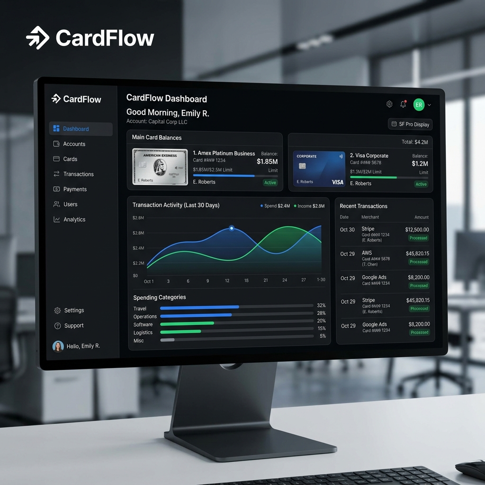
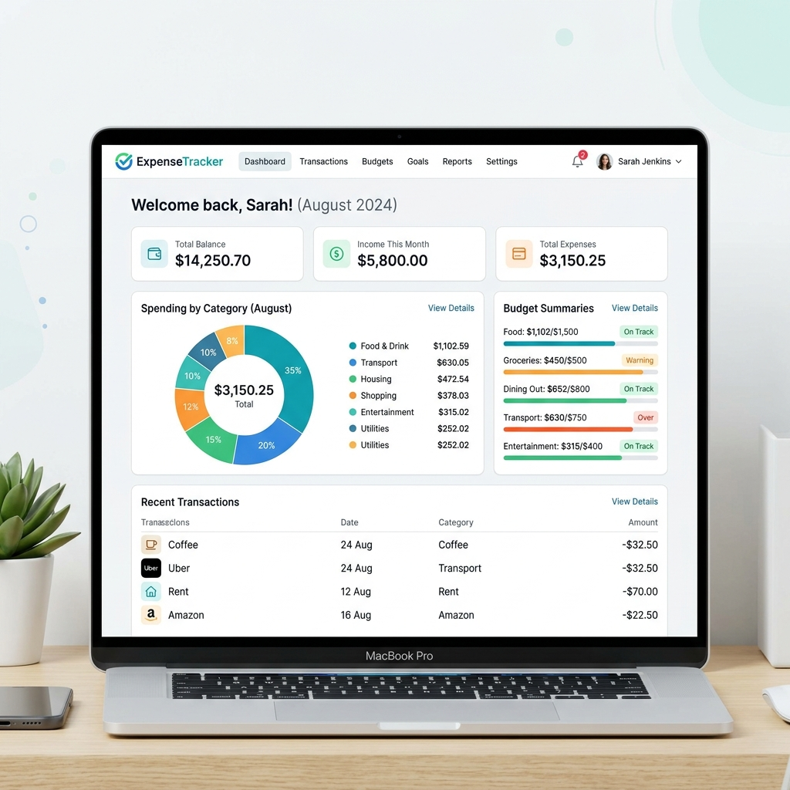
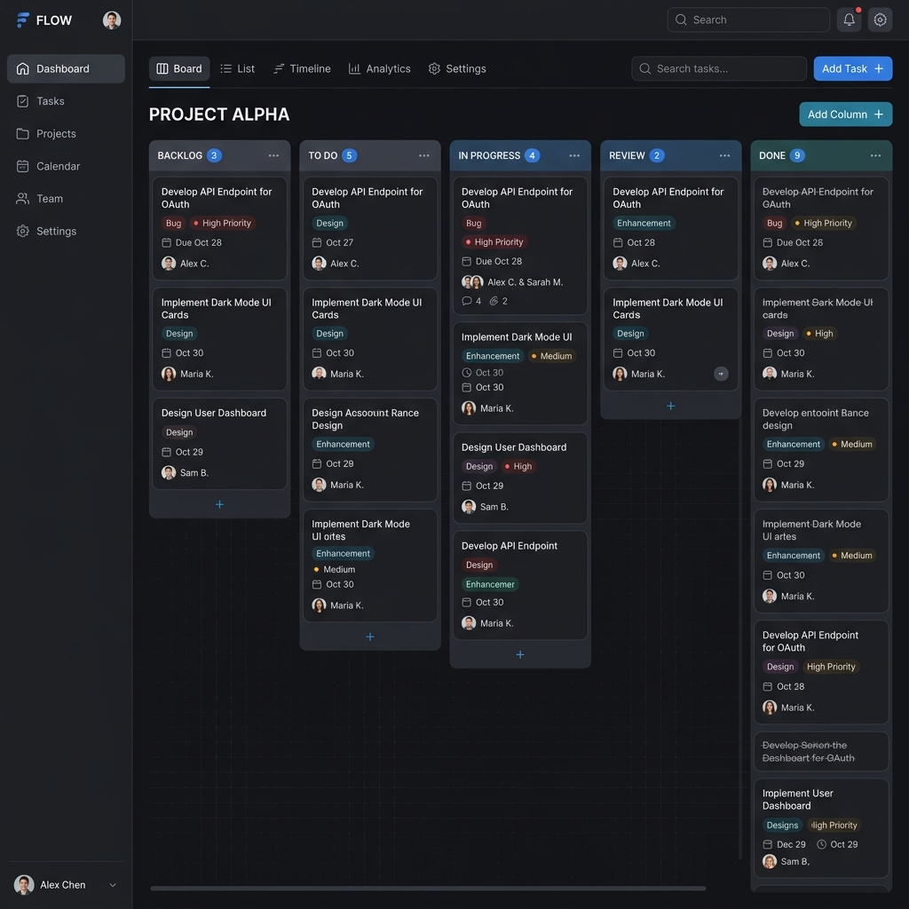

<!--
  ======================================================================
  SETH BARAKA - ENGINEERING PORTFOLIO
  ======================================================================
-->

<table width="100%">
<tr>
<td width="60%" valign="top">

# Hi, I'm Seth Baraka 👋

**Full-Stack Software Engineer passionate about building scalable, secure, and production-ready software.**

  
  
  

 

> _"Code. Learn. Build. Deploy. Repeat."_

</td>
<td width="40%" align="center">
  <!-- Ensure you place a matching laptop illustration in your assets folder -->
  
</td>
</tr>
</table>

<table width="100%">
<tr>
<td width="50%" valign="top">

### 👨‍💻 ABOUT ME

I'm a Software Engineer from Kenya who enjoys designing and building software that solves practical problems.

My focus is on becoming an enterprise-level Full-Stack Engineer by mastering modern frontend development, backend engineering with ASP.NET Core, cloud deployment, databases, software architecture, testing, and DevOps.

I believe software engineering is more than writing code—it's understanding business problems, designing maintainable systems, and delivering reliable solutions.

</td>
<td width="50%" valign="top">

### 🚀 CURRENT FOCUS

- 🏗️ Building **CardFlow**, an enterprise banking platform.
- 🛡️ Mastering ASP.NET Core & Clean Architecture.
- ⚙️ Deepening system design & software architecture.
- 🔄 Strengthening testing, CI/CD, Docker & cloud skills.
- 🚀 Building projects that solve real-world problems.

</td>
</tr>
</table>

### 💻 TECH STACK

<table width="100%">
<tr>
<td width="25%" valign="top">
  <b>Frontend</b>  
   
  React &nbsp; Next.js &nbsp; TypeScript &nbsp; JavaScript &nbsp; Tailwind
</td>
<td width="25%" valign="top">
  <b>Backend</b>  
   
  ASP.NET Core &nbsp; C# &nbsp; Node.js &nbsp; REST&nbsp;API
</td>
<td width="25%" valign="top">
  <b>Database</b>  
  
   
  PostgreSQL &nbsp; Redis &nbsp; SQL&nbsp;Server &nbsp; MySQL &nbsp; MongoDB
</td>
<td width="25%" valign="top">
  <b>DevOps & Tools</b>  
   
  Docker &nbsp; CI/CD &nbsp; AWS &nbsp; Azure &nbsp; Figma &nbsp; VS&nbsp;Code
</td>
</tr>
</table>

### ⭐ FEATURED PROJECTS

<a href="#">View all repositories →</a>

<table width="100%">
<tr>
<td width="33%" valign="top">
  <b>🏦 CardFlow</b>  
  
Enterprise banking platform with card management, transactions, billing, notifications and analytics.

  
  
    
  <i>Updated 2 days ago</i>  
  
</td>
<td width="33%" valign="top">
  <b>📊 ExpenseTracker</b>  
  
Personal finance tracker to manage income, expenses and budgets with analytics.

  
  
    
  <i>Updated 3 weeks ago</i>  
  
</td>
<td width="33%" valign="top">
  <b>📋 TaskFlow API</b>  
  
A clean REST API for task management with JWT authentication and role-based access.

  
  
    
  <i>Updated 1 month ago</i>  
  
</td>
</tr>
</table>

<table width="100%">
<tr>
<td width="33%" valign="top">

### 📚 CURRENTLY LEARNING

- ✅ Advanced System Design
- ✅ Microservices with ASP.NET Core
- ✅ Event-Driven Architecture
- ✅ Kubernetes
- ⏳ AWS Solutions Architecture

</td>
<td width="33%" valign="top">

### 🏆 CERTIFICATIONS

- 🟢 **AWS Certified Cloud Practitioner** 
  Issued Jan 2024
- 🔵 **Microsoft Certified: Azure Fundamentals** 
  Issued Dec 2023

 
<a href="https://linkedin.com/in/sethbaraka">View more on LinkedIn →</a>

</td>
<td width="33%" valign="top">

### 🎯 2026 GOALS

- ✅ Contribute to open source projects
- ✅ Build 5 production-grade applications
- ✅ Write technical articles regularly
- 🟢 Earn AWS Solutions Architect Associate
- 🟢 Help 100+ developers through mentorship

</td>
</tr>
</table>

<table width="100%">
<tr>
<td width="33%" valign="top">

### 📫 CONNECT WITH ME

 

</td>
<td width="33%" valign="top" align="center">
 
<blockquote>
"As long as I'm alive, there are infinite chances." 
— Monkey D. Luffy
</blockquote>
</td>
<td width="33%" valign="top" align="center">
 
<b>Thanks for visiting!</b>  
<!-- Add a pixel art gif to your assets folder -->
 
Let's build something amazing together 🚀
</td>
</tr>
</table>

 

© 2026 Seth Baraka • Built with ❤️ and lots of ☕

